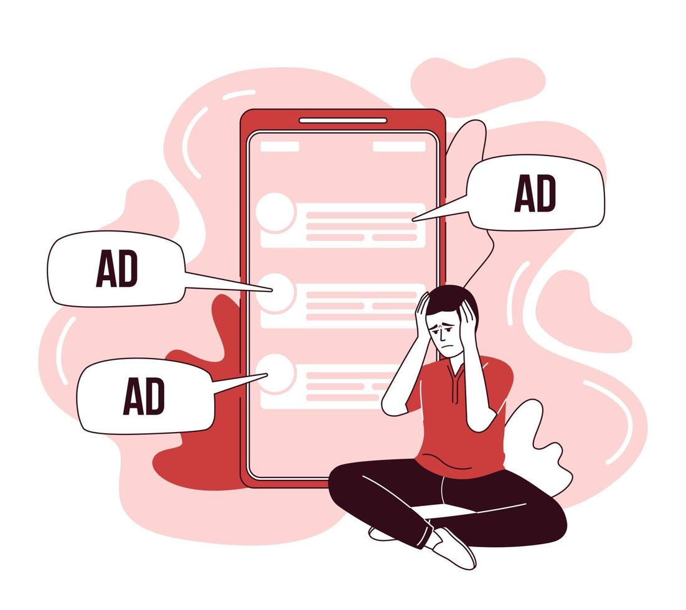
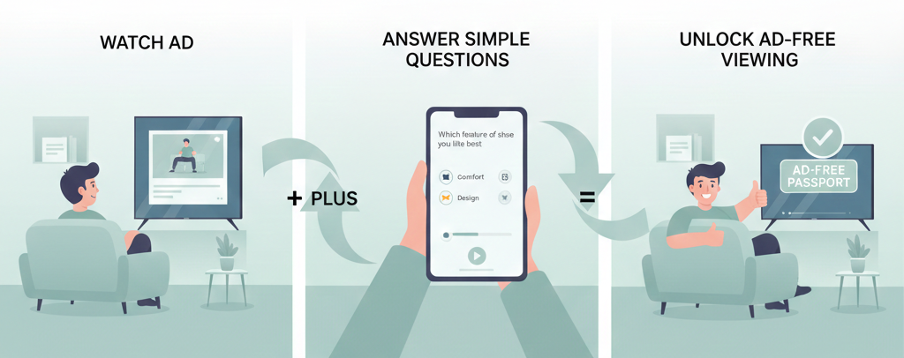
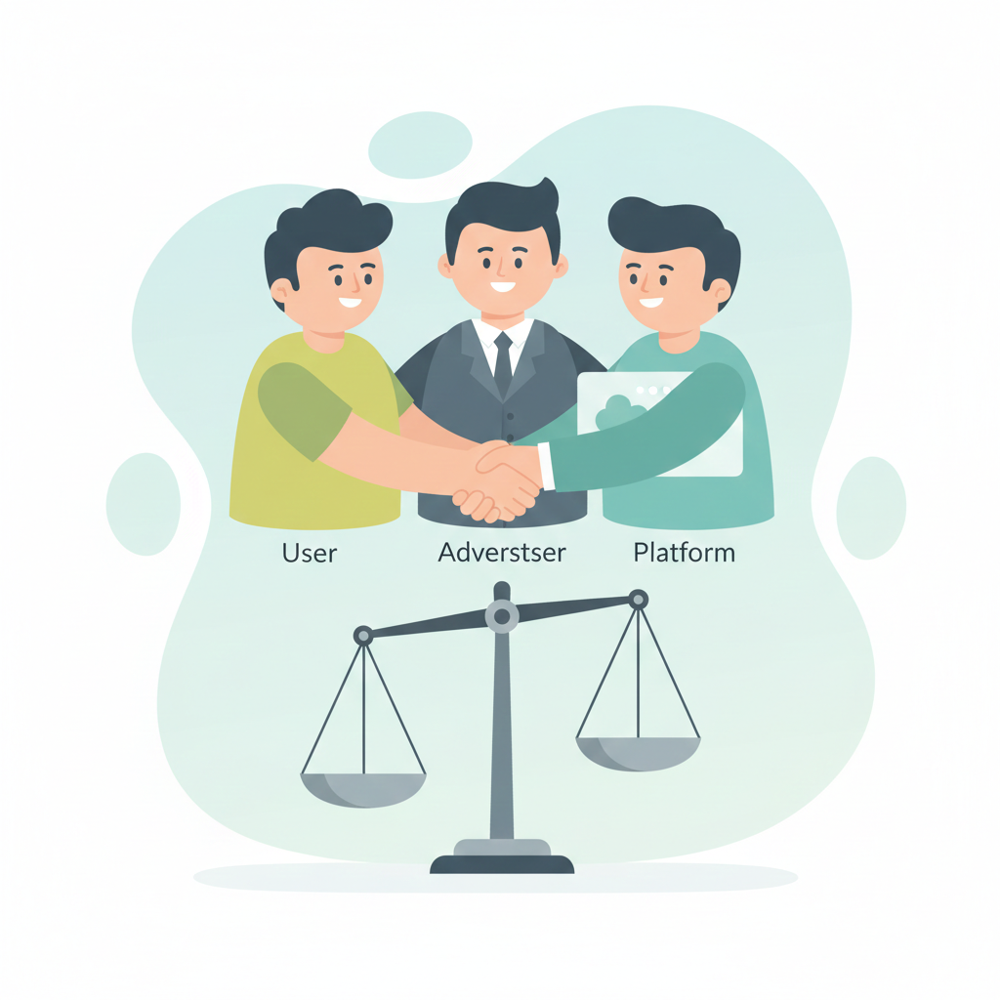
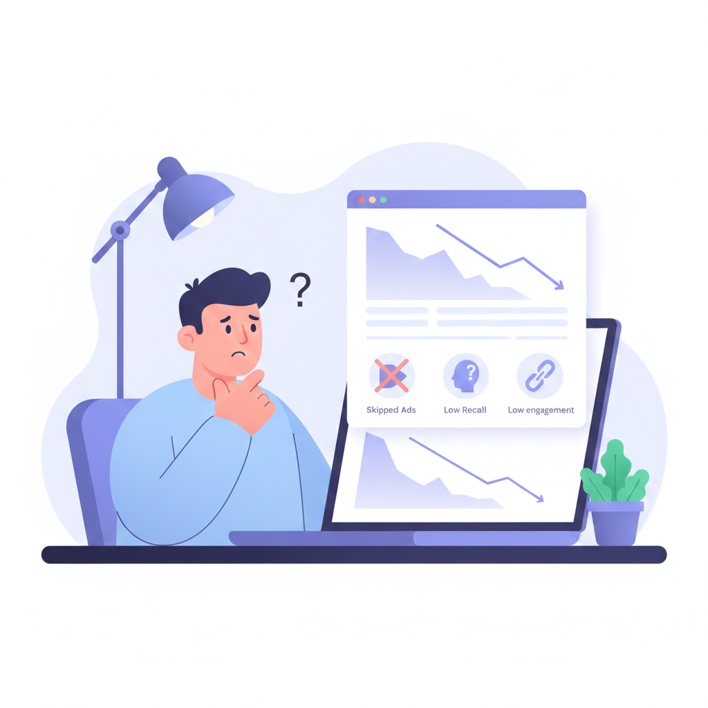
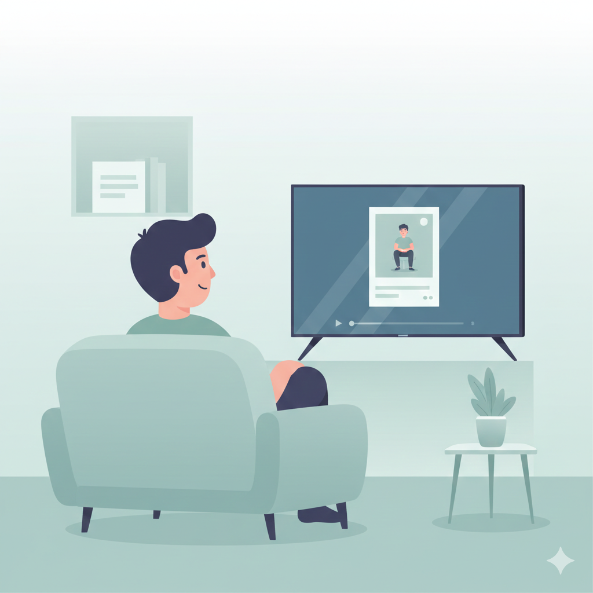
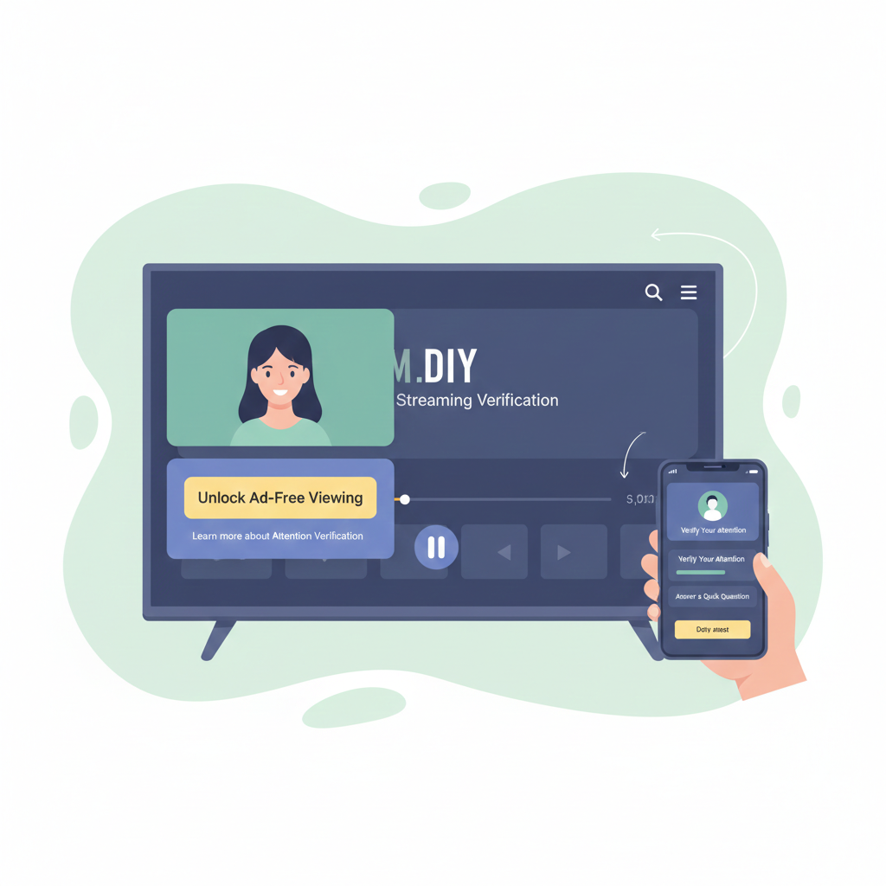

# 🎯 Attention-Verified Ads
### Ads - From Impressions to Proven Attention

---

## 🧾 Overview

**Attention-Verified Ads** is a next-generation advertising model that replaces
traditional **impression-based ads** with **verified human attention**.

Instead of interrupting users repeatedly, the system allows users to unlock
**ad-free content** by watching **one focused ad** and validating attention
through a short interaction.

> From impressions → to attention → to trust.

---

<table>
<tr>
<td width="50%" align="center" valign="middle">

</td>
<td width="60%" valign="top">

## ❓ Problem Statement

Current digital advertising suffers from:
- ❌ Skipped or ignored ads
- ❌ Low brand recall
- ❌ User frustration & churn
- ❌ Advertisers paying for fake or passive views

OTT platforms face a dilemma:
- More ads = more revenue but higher churn
- Fewer ads = user happiness but revenue loss

</td>
</tr>
</table>

---

<table>
<tr>
<td width="50%" align="center" valign="middle">

</td>
<td width="60%" valign="top">

## 💡 Core Insight

> Users are not against ads — they are against **interruption**.

People are willing to:
- Watch **one full ad**
- If it guarantees **uninterrupted viewing afterward**

This creates an opportunity for **Attention-Verified Advertising**.

</td>
</tr>
</table>

---

## 🚀 The Solution

**Attention-Verified Ads** introduces a fair exchange:

🎥 *Focused attention once*  ➡️ ⏱️ *Ad-free content time*

Attention is verified using:
- Full ad watch
- Simple MCQ-based recall check

---

## 🔄 User Flow

1. User clicks **“Unlock Ad-Free Viewing”**
2. Watches **one non-skippable ad**
3. Answers **2–3 MCQs** based on the ad
4. On success → unlocks **30 minutes ad-free** or **ad-free movie** or **ad-free Match**

---

## ✨Prototype

**Click and enjoy the flow -** [link](https://raguram-n.github.io/Attention-Verified-Ads/)

---

<table>
<tr>
<td width="50%" align="center" valign="middle">

</td>
<td width="60%" valign="top">

## 🎯 Value Proposition

### 👤 Users
- Control over ads
- No mandatory payment
- Peaceful viewing experience

### 📢 Advertisers
- Guaranteed ad completion
- Verified recall (not just views)
- Higher engagement quality

### 📺 Platforms
- Reduced churn
- New premium ad inventory
- Works alongside existing ad models

</td>
</tr>
</table>

---

<table>
<tr>
<td width="50%" align="center" valign="middle">

</td>
<td width="60%" valign="top">

## 🆚 In past

| Model | Limitation |
|------|-----------|
| Skippable Ads | No real attention |
| Long Ad Breaks | User frustration |
| Subscriptions | Price sensitivity |
| Reward Ads (Games) | Low brand seriousness |

✅ **Attention-Verified Ads = Proof of attention**

</td>
</tr>
</table>

---

## 💰 Monetization Model (just a intial research)

### Users
- Free access to content
- Unlock ad-free viewing by watching one premium, attention-verified ad
- No mandatory subscription or payments

### Advertisers (Premium Ads Category)

Opt into Attention-Verified Ads (AVA) as a premium inventory
Pay a higher CPM / CPA for:
- 100% ad completion
- Verified attention via recall validation
- Brand recall & engagement metrics (post-ad)
- Priced above standard skippable and mid-roll ads
- Ideal for brand launches, marquee campaigns, and high-impact moments

### Platform (JioHotstar / OTT)

- Introduces a new premium ad tier (in addition to existing ads)
- Higher revenue per ad slot (premium pricing)
- Reduced ad load → lower churn
- Improved user satisfaction → higher LTV
- Revenue share with advertisers based on verified attention events

## 🔑 Key Shift

> ✨Users pay with attention, advertisers pay for proof.

---

## 🛡️ Abuse Prevention

- Daily unlock limits
- Randomized MCQs
- Anti-bot detection
- Pattern-based fraud analysis (future AI)

---

<table>
<tr>
<td width="50%" align="center" valign="middle">

</td>
<td width="60%" valign="top">
  
## 🧠 Key Features

- 🧠 Attention Verification Engine
- 🧾 Recall-Based MCQs
- ⏱️ Ad-Free Time Wallet
- 📊 Advertiser Analytics Dashboard
- 🎯 User Control Panel

---

## 🎯 Target Use Cases

- OTT & Streaming platforms
- News & sports apps
- Educational video platforms
- Movie discovery platforms

</td>
</tr>
</table>

---

## 🧱 Tech Stack (Concept)

| Layer | Technology |
|-----|------------|
| Frontend | HTML / CSS / JS / React |
| Backend | Node.js / Flask |
| Database | Firebase / MongoDB |
| Ads | OTT / Ad Network APIs |
| Future AI | Attention scoring & fraud detection |

---

## 🧭 Roadmap

- [ ] Build watch + MCQ prototype
- [ ] Add ad-free timer logic
- [ ] Create advertiser dashboard
- [ ] Pilot with content platform
- [ ] Introduce AI-based attention scoring

---

<table>
<tr>
<td width="50%" align="center" valign="middle">

</td>
<td width="60%" valign="top">

## 🚀 Future Scope

- AI-based attention scoring
- Mobile SDK for OTT apps
- Multi-language support
- Open Attention Verification API
- Attention-based ad pricing

</td>
</tr>
</table>

---

<table>
<tr>
<td width="50%" align="center" valign="middle">

</td>
<td width="60%" valign="top">
  
## 🏁 Conclusion

**Attention-Verified Ads** creates a win-win ecosystem:

- Users get peace
- Advertisers get proof
- Platforms get sustainability

> Advertising should be earned, not forced.

</td>
</tr>
</table>

---

## 👤 Author

**Raguram Narayanaswamy**  
Product Thinking | UX | QA | Growth Strategy
